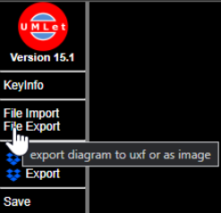
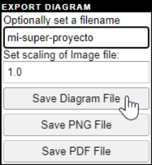
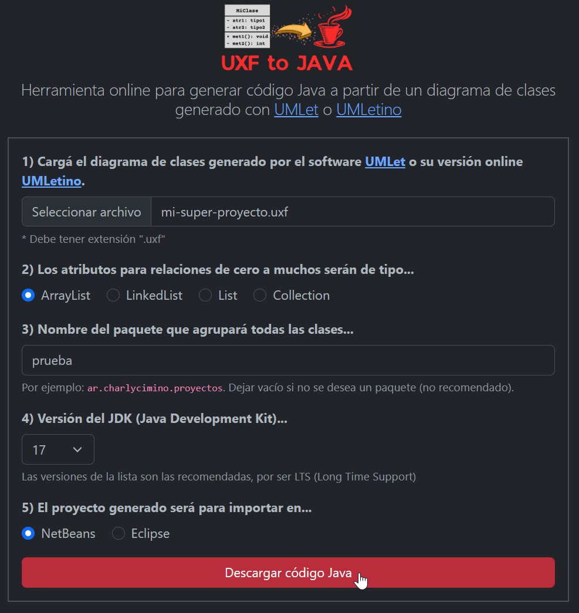
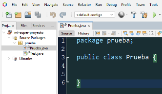
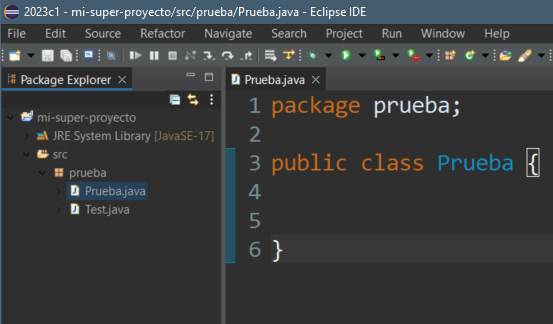

**Herramienta online para generar código Java a partir de un diagrama de clases generado con [UMLet](https://www.umlet.com/) o [UMLetino](https://www.umletino.com/umletino.html).**

## Índice
- [Índice](#índice)
- [Cómo se usa ❓](#cómo-se-usa-)
- [Accedé a la App ✨](#accedé-a-la-app-)
- [Documentación 📖](#documentación-)
- [Dependencias 📚](#dependencias-)
- [Licencia 📄](#licencia-)
- [Autor 👨](#autor-)
- [Colaborar 🎁](#colaborar-)

## Cómo se usa ❓
1. Generá un diagrama de clases UML con la herramienta [UMLet](https://www.umlet.com/) o [UMLetino](https://www.umletino.com/umletino.html). Si no sabés cómo, [te lo enseño aquí](https://youtu.be/PJPjYslwuKk).
2. Exportá el diagrama de clases UML como se muestra en imagen, colocando un nombre preferentemente sin espacios. Se guardará un archivo con extensión ".uxf" en tu computadora.

  

3. [Abrí la app UXF to JAVA](https://charlycimino.github.io/uxf-to-java) y seguí las instrucciones del formulario. Luego presioná el botón *Descargar código Java* para generar y descargar el proyecto en formato .zip.

4. Abrí tu *IDE* seleccionado e importá el proyecto .zip. Si no sabés cómo, aquí te lo enseño [para NetBeans](https://youtu.be/eZkQJn40tsQ) o [para Eclipse](#).
5. **¡Ya tenés tu proyecto Java creado con sus respectivas clases!**
   
 

## Accedé a la App ✨ 
El único requisito es tener un navegador web. Simplemente entrá al [siguiente enlace](https://charlycimino.github.io/uxf-to-java).

## Documentación 📖

[Revisá la documentación](documentacion.md) para saber cómo escribir correctamente el diagrama de clases UML y evitar errores en la generación de código Java.

## Dependencias 📚
Este proyecto cuenta con dependencias creadas por terceros.
* [x2js](https://github.com/abdolence/x2js), para parsear el archivo .uxf a JavaScript.
* [JSZip](https://stuk.github.io/jszip/), para generar y exportar el proyecto como .zip

## Licencia 📄
Este proyecto está bajo la [Licencia GNU GPLv3](COPYING).

## Autor 👨

## Colaborar 🎁

Este proyecto fue hecho con pasión y empeño para toda la comunidad educativa sin ningún tipo de ánimo de lucro, aún así, agradecería mucho que colabores conmigo de alguna de las siguientes formas:

* Comentá a otros sobre este proyecto 📢
* Invitame un café ☕
  * [Desde Argentina 🇦🇷](https://cafecito.app/charlycimino)
  * [Fuera de Argentina 🌎](https://cafecito.app/charlycimino)
* Suscribite a [mi canal de Youtube ▶️](https://paypal.me/charlycimino)
* Visitá mi [sitio web](https://charlycimino.com/) 🌐.
* Seguime en mis redes sociales 🤳
  * [Instagram](https://www.instagram.com/charlycimino/)
  * [Facebook](https://www.facebook.com/charlyycimino/)
  * [Linkedin](https://www.linkedin.com/in/charlycimino/)
---
Con ❤️ por [Charly Cimino](https://github.com/CharlyCimino) 😊
