#Documentación 📖

##Índice

- [Cómo representar clases UML](#cómo-representar-clases-uml)
  - [Nombre de la clase UML](#nombre-de-la-clase-uml)
  - [Atributos de la clase UML](#atributos-de-la-clase-uml)
    - [Estructura de un atributo UML](#estructura-de-un-atributo-uml)
  - [Métodos de la clase UML](#métodos-de-la-clase-uml)
    - [Estructura de un método UML](#estructura-de-un-método-uml)
    - [Método estático](#método-estático)
    - [Método abstracto](#método-abstracto)
    - [Método constructor](#método-constructor)
- [Enumeraciones](#enumeraciones)
  - [Valores de las clases enumeradas](#valores-de-las-clases-enumeradas)
  - [Enumeraciones con atributos y métodos](#enumeraciones-con-atributos-y-métodos)
- [Interfaces](#interfaces)
- [Cómo representar relaciones UML](#cómo-representar-relaciones-uml)
    - [Tipos de asociación](#tipos-de-asociación)
    - [Cardinalidad de la relación](#cardinalidad-de-la-relación)
    - [Atributo asociado a la relación](#atributo-asociado-a-la-relación)
  - [Relación de asociación](#relación-de-asociación)
    - [Tipos de asociación](#tipos-de-asociación-1)
    - [Cardinalidad de la relación](#cardinalidad-de-la-relación-1)
      - [Un solo elemento](#un-solo-elemento)
      - [De cero/uno a muchos elementos](#de-cerouno-a-muchos-elementos)
      - [Número definido de elementos](#número-definido-de-elementos)
      - [Arrays de más de una dimensión](#arrays-de-más-de-una-dimensión)
    - [Nombre de la relación](#nombre-de-la-relación)
  - [Relación de generalización (herencia)](#relación-de-generalización-herencia)
  - [Relación de realización (interfaz)](#relación-de-realización-interfaz)
- [Elementos omitidos](#elementos-omitidos)
- [Errores posibles](#errores-posibles)

## Cómo representar clases UML
Los miembros de una clase UML con la herramienta [UMLet](https://www.umlet.com/) o [UMLetino](https://www.umletino.com/umletino.html) se escriben en la ventana de propiedades (*Properties*). Podés ver el paso a paso en video [aquí](https://youtu.be/PJPjYslwuKk).

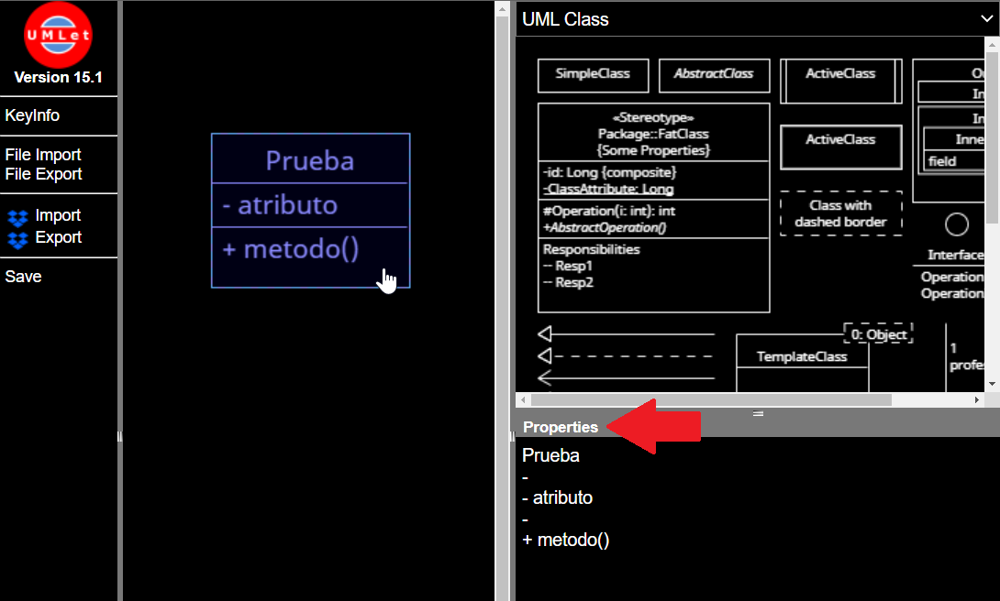

Las clases en UML deberán tener la siguiente estructura:
1.  Nombre de la clase ***(obligatorio)***
2.  Separador: `--` ***(obligatorio)***
3.  Atributos de la clase
4.  Separador: `--` ***(obligatorio si hay métodos)***
5.  Métodos de la clase

Si bien UMLet permite un solo guión medio `-` para dibujar un separador, se recomienda usar `--` para evitar ambigüedades con la visibilidad `private` a la hora de exportar a código Java.

### Nombre de la clase UML

El nombre de la clase UML será el utilizado cuando se la exporte a código Java. Recordá seguir la convención de nomenclatura: En singular y con notación **U**pper**C**amel**C**ase.
Por defecto, la clase en Java será `public`.

<table>
<tr>
<th> En UMLet (<em>Properties</em>) </th> <th> En UMLet (<em>renderizado</em>) </th> <th> En Java </th>
</tr>
<tr>
<td> 

  ```
  Persona
  ```
</td>
<td>
        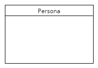
        </td>  
<td>

```java
public class Persona {
  // ...
}
  ``` 
</td>
</tr>
</table>

Si el nombre de la clase está encerrada entre barras `/`, se la considerará una clase abstracta (`abstract`).
<table>
<tr>
<th> En UMLet (<em>Properties</em>) </th> <th> En UMLet (<em>renderizado</em>) </th> <th> En Java </th>
</tr>
<tr>
<td> 

  ```
  /Persona/
  ```
</td>
<td>
        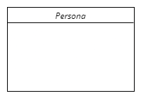
        </td>  
<td>

```java
public abstract class Persona {
  // ...
}
  ``` 
</td>
</tr>
</table>

### Atributos de la clase UML
Los atributos de una clase UML se deben listar uno debajo del otro con la sintaxis adecuada.
Es esencial separar el nombre de la clase de la lista de atributos con una línea que contenga unicamente: `--`. 
Aún cuando la clase no tenga atributos, se debe colocar obligatoriamente el separador `--`.

<table>
<tr>
<th> En UMLet (<em>Properties</em>) </th> <th> En UMLet (<em>renderizado</em>) </th> <th> En Java </th>
</tr>
<tr>
<td> 

  ```
  Persona
  --
  -nombre
  -apellido
  ```
</td>
<td>
        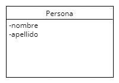
        </td>  
<td>

```java
public class Persona {
  private Object nombre;
  private Object apellido;
}
  ``` 
</td>
</tr>
</table>

#### Estructura de un atributo UML
Los atributos de una clase UML deberán tener la siguiente estructura:
1.  Visibilidad (`-`, `#`, o `+`) ***(opcional)***
2.  Nombre del atributo ***(obligatorio)*** Solo puede contener una letra seguida de 0 o más letras, números o guiones bajos.
3.  Tipo de dato ***(opcional)*** Un símbolo `:` seguido del tipo de dato. Si no se coloca, se asumirá que es de tipo `Object`.
4.  Valor ***(opcional)*** Un símbolo `=` seguido de un valor numérico, caracter o cadena. Si se coloca, se asumirá que se trata de un valor constante (`final`).

<table>
<tr>
<th> En UMLet (<em>Properties</em>) </th> <th> En UMLet (<em>renderizado</em>) </th> <th> En Java </th>
</tr>
<tr>
<td> 

  ```
  Persona
  --
  nombre
  - apellido
  # activa: boolean
  + CANT_OJOS: int = 2
  ```
</td>
<td>
        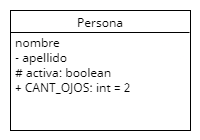
        </td>  
<td>

```java
public class Persona {
  Object nombre;
  private Object apellido;
  protected boolean activa;
  public final int CANT_OJOS = 2;
}
  ``` 
</td>
</tr>
</table>

Si el atributo está encerrado entre guiones bajos `_`, se lo considerará un atributo de clase (`static`).

<table>
<tr>
<th> En UMLet (<em>Properties</em>) </th> <th> En UMLet (<em>renderizado</em>) </th> <th> En Java </th>
</tr>
<tr>
<td> 

  ```
  Persona
  --
  _+ CANT_OJOS: int = 2_
  ```
</td>
<td>
        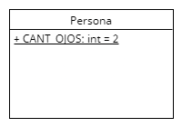
        </td>  
<td>

```java
public class Persona {
  public static final int CANT_OJOS = 2;
}
  ``` 
</td>
</tr>
</table>

### Métodos de la clase UML
Los métodos de una clase UML se deben listar uno debajo del otro con la sintaxis adecuada.
Es esencial separarlos de la lista de atributos con una línea que contenga unicamente: `--`. 
Aún cuando la clase no tenga atributos, se debe colocar dos veces obligatoriamente el separador `--` (uno en cada línea).

#### Estructura de un método UML
Los atributos de una clase UML deberán tener la siguiente estructura:
1.  Visibilidad (`-`, `#`, o `+`) ***(opcional)***
2.  Nombre del método ***(obligatorio)*** Solo puede contener una letra seguida de 0 o más letras o números.
3.  Lista de parámetros entre paréntesis ***(obligatorio)***
    *  Si el método no lleva parámetros, se dejan los paréntesis vacíos.
        <table>
        <tr>
        <th> En UMLet (<em>Properties</em>) </th> <th> En UMLet (<em>renderizado</em>) </th> <th> En Java </th>
        </tr>
        <tr>
        <td> 

          ```
          Persona
          --
          - nombre: String
          --
          hablar()
          ```
        </td>
        <td>
        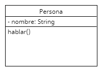
        </td>  
        <td>

        ```java
        public class Persona {
          private String nombre;

          void hablar() {
            // Método a resolver...
          }
        }
          ``` 
        </td>
        </tr>
        </table>
    *  Si el método lleva parámetros, cada uno de ellos se separa por comas. De cada parámetro solo debe escribir el tipo: `metodo(Tipo1, Tipo2)`
        <table>
        <tr>
        <th> En UMLet (<em>Properties</em>) </th> <th> En UMLet (<em>renderizado</em>) </th> <th> En Java </th>
        </tr>
        <tr>
        <td> 

          ```
          Persona
          --
          - nombre: String
          --
          caminar(Punto)
          caminar(int, double)
          ```
        </td>
        <td>
        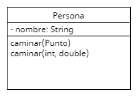
        </td>  
        <td>

        ```java
        public class Persona {
          private String nombre;

          void caminar(Punto punto1) {
            // Método a resolver...
          }
          void caminar(int int1, double double2) {
            // Método a resolver...
          }
        }
          ``` 
        </td>
        </tr>
        </table>
    *  Se puede escribir opcionalmente el nombre de un parámetro seguido de un `:` y su tipo: `metodo(x: Tipo1, y: Tipo2)`
        <table>
        <tr>
        <th> En UMLet (<em>Properties</em>) </th> <th> En UMLet (<em>renderizado</em>) </th> <th> En Java </th>
        </tr>
        <tr>
        <td> 

          ```
          Persona
          --
          - nombre: String
          --
          caminar(p: Punto)
          caminar(x: int, y: double)
          caminar(int, y: double)
          caminar(x: int, double)
          ```
        </td>
        <td>
        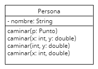
        </td>  
        <td>

        ```java
        public class Persona {
          private String nombre;

          void caminar(Punto p) {
            // Método a resolver...
          }
          void caminar(int x, double y) {
            // Método a resolver...
          }
          void caminar(int int1, double y) {
            // Método a resolver...
          }
          void caminar(int x, double double2) {
            // Método a resolver...
          }
        }
          ``` 
        </td>
        </tr>
        </table>
4.  Valor de retorno ***(opcional)*** Un símbolo `:` seguido del tipo de dato. Si no se coloca, se asumirá que es de tipo `void`.

#### Método estático
Si un método está encerrado entre guiones bajos `_`, se lo considerará un método de clase (`static`).

<table>
<tr>
<th> En UMLet (<em>Properties</em>) </th> <th> En UMLet (<em>renderizado</em>) </th> <th> En Java </th>
</tr>
<tr>
<td> 

  ```
  Persona
  --
  --
  _+ setCANT_OJOS(int): void_
  ```
</td>
<td>
        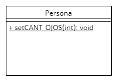
        </td>  
<td>

```java
public class Persona {
  public static void setCANT_OJOS(int int1) {
    // Método a resolver...
  }
}
  ``` 
</td>
</tr>
</table>

#### Método abstracto
Si un método está encerrado entre barras `/`, se lo considerará un método abstracto (`abstract`). En ese caso, recordá que la clase también deberá ser abstracta.

<table>
<tr>
<th> En UMLet (<em>Properties</em>) </th> <th> En UMLet (<em>renderizado</em>) </th> <th> En Java </th>
</tr>
<tr>
<td> 

  ```
  /Persona/
  --
  --
  /+ hablar(): void/
  ```
</td>
<td>
        
        </td>  
<td>

```java
public abstract class Persona {
  public abstract void hablar();
}
  ``` 
</td>
</tr>
</table>

#### Método constructor
Si un método se llama exactamente igual que la clase, se lo considerará un método constructor (por ende, no se le pondrá tipo de retorno).

<table>
<tr>
<th> En UMLet (<em>Properties</em>) </th> <th> En UMLet (<em>renderizado</em>) </th> <th> En Java </th>
</tr>
<tr>
<td> 

  ```
  Persona
  --
  - nombre: String
  --
  + Persona(n: String)
  ```
</td>
<td>
        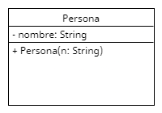
        </td>  
<td>

```java
public class Persona {
  private String nombre;

  public Persona(String n) {
    // Constructor a resolver...
  }
}
  ``` 
</td>
</tr>
</table>

## Enumeraciones
Si colocás el estereotipo `<<enum>>` o `<<enumeration>>` justo encima del nombre de la clase, se asumirá que se trata de una clase enumerada.

<table>
<tr>
<th> En UMLet (<em>Properties</em>) </th> <th> En UMLet (<em>renderizado</em>) </th> <th> En Java </th>
</tr>
<tr>
<td> 

  ```
  <<enum>>
  Color
  ```
</td>
<td>
        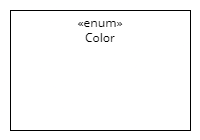
        </td>  
<td>

```java
public enum Color {
  
}
  ``` 
</td>
</tr>
</table>

### Valores de las clases enumeradas

En su versión más simple, los valores enumerados se escriben uno debajo del otro con su valor, por convención, en MAYÚSCULAS.

<table>
<tr>
<th> En UMLet (<em>Properties</em>) </th> <th> En UMLet (<em>renderizado</em>) </th> <th> En Java </th>
</tr>
<tr>
<td> 

  ```
  <<enum>>
  Color
  --
  ROJO
  VERDE
  AZUL
  ```
</td>
<td>
        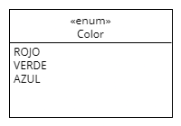
        </td>  
<td>

```java
public enum Color {
  ROJO,
  VERDE,
  AZUL;
}
  ``` 
</td>
</tr>
</table>

Como los enums son, por defecto, objetos de la misma clase que los enumera, públicos y estáticos, también se los puede escribir de la siguiente forma, teniendo el mismo efecto:

<table>
<tr>
<th> En UMLet (<em>Properties</em>) </th> <th> En UMLet (<em>renderizado</em>) </th> <th> En Java </th>
</tr>
<tr>
<td> 

  ```
  <<enum>>
  Color
  --
  _+ROJO: Color_
  _+VERDE: Color_
  _+AZUL: Color_
  ```
</td>
<td>
        
        </td>  
<td>

```java
public enum Color {
  ROJO,
  VERDE,
  AZUL;
}
  ``` 
</td>
</tr>
</table>
  
### Enumeraciones con atributos y métodos

Es posible tener atributos y métodos en una enumeración, en tal caso, primero se escriben los valores enumerados seguidos de los atributos, luego un separador `--` y finalmente, si los hay, la lista de métodos.

<table>
<tr>
<th> En UMLet (<em>Properties</em>) </th> <th> En UMLet (<em>renderizado</em>) </th> <th> En Java </th>
</tr>
<tr>
<td> 

  ```
  <<enum>>
  Color
  --
  +ROJO
  +VERDE
  +AZUL
  -valorRGB: String
  --
  + getValorRGB(): String
  ```
</td>
<td>
        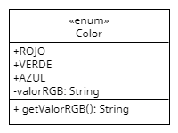
        </td>  
<td>

```java
public enum Color {
  ROJO,
  VERDE,
  AZUL;
  private String valorRGB;

  public String getValorRGB() {
    // Método a resolver
    return "";
  }
}
  ``` 
</td>
</tr>
</table>

Si la clase enumerada tiene un constructor con parámetros (por definición, debe ser `private`), se pueden colocar los valores concretos a cada valor enumerado entre paréntesis.

<table>
<tr>
<th> En UMLet (<em>Properties</em>) </th> <th> En UMLet (<em>renderizado</em>) </th> <th> En Java </th>
</tr>
<tr>
<td> 

  ```
  <<enum>>
  Color
  --
  +ROJO("#FF0000", "RED")
  +VERDE("#00FF00", "GREEN")
  +AZUL("#0000FF", "BLUE")
  -valorRGB: String
  -enIngles: String
  --
  - Color(valorRGB: String, enIngles: String)
  + getValorRGB(): String
  + getEnIngles(): String
  ```
</td>
<td>
        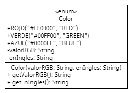
        </td>  
<td>

```java
public enum Color {
  ROJO("#FF0000", "RED"),
  VERDE("#00FF00", "GREEN"),
  AZUL("#0000FF", "BLUE");

  private String valorRGB;
  private String enIngles;

  public Color(String valorRGB, String enIngles) {
    // Constructor a resolver
  }

  public String getValorRGB() {
    // Método a resolver
    return "";
  }

  public String getEnIngles() {
    // Método a resolver
    return "";
  }
}
  ``` 
</td>
</tr>
</table>

## Interfaces

Si colocás el estereotipo `<<interface>>` o `<<interfaz>>` justo encima del nombre de la clase, se asumirá que se trata de una interfaz.

<table>
<tr>
<th> En UMLet (<em>Properties</em>) </th> <th> En UMLet (<em>renderizado</em>) </th> <th> En Java </th>
</tr>
<tr>
<td> 

  ```
  <<interface>>
  /Mostrable/
  --
  --
  /+ mostrar()/
  ```
</td>
<td>
        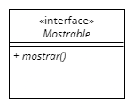
        </td>  
<td>

```java
public interface Mostrable {
  public abstract void mostrar();
}
  ``` 
</td>
</tr>
<tr>
<td> 

  ```
  <<interface>>
  /Facturable/
  --
  _+ IVA: double = 0.21_
  --
  /+ facturar(): double/
  ```
</td>
<td>
        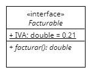
        </td>  
<td>

```java
public interface Facturable {
  public static final double IVA = 0.21;

  public abstract double facturar();
}
  ``` 
</td>
</tr>
</table>

## Cómo representar relaciones UML
Las relaciones entre clases UML son representadas mediante flechas, que pueden colocarse en el editor haciendo doble click en alguna que figure en la paleta de elementos.

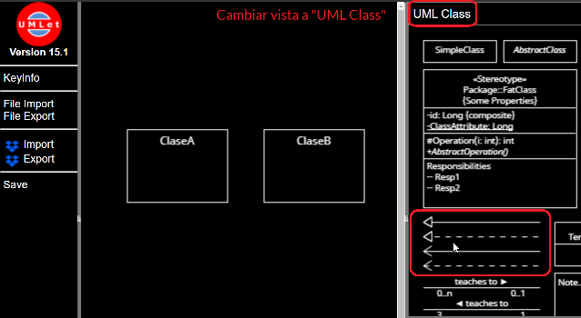

#### Tipos de asociación
#### Cardinalidad de la relación
#### Atributo asociado a la relación

### Relación de asociación
Una relación de asociación representa que una `ClaseA` se compone de una `ClaseB`, por lo tanto, en la `ClaseA` habrá un atributo de la `ClaseB`.

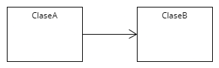

#### Tipos de asociación
En UML, una asociación se representa con una flecha sólida. Si se desea, se puede conceptualizar el tipo de asociación entre agregación (rombo hueco) o composición (rombo lleno). A la hora de exportar a código, producirán el mismo resultado.

Para editar las propiedades (*properties*) de una flecha, hacé click en ella.

<table>
<tr>
<th> En UMLet (<em>Properties</em>) </th> <th> En UMLet (<em>renderizado</em>) </th> <th> En Java </th>
</tr>
<tr>
<td> 

  ```
  lt=<-
  ```
</td>
<td>
        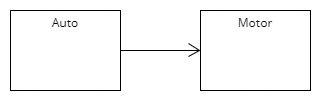
        </td>  
<td>

```java
public class Auto {
  Motor sinNombre;
}
  ``` 
</td>
</tr>
<tr>
<td> 

  ```
  lt=<->>>>
  ```
</td>
<td>
        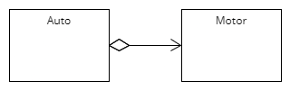
        </td>  
<td>

```java
public class Auto {
  Motor sinNombre;
}
  ``` 
</td>
</tr>
<tr>
<td> 

  ```
  lt=<->>>>>
  ```
</td>
<td>
        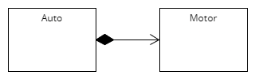
        </td>  
<td>

```java
public class Auto {
  Motor sinNombre;
}
  ``` 
</td>
</tr>
</table>

#### Cardinalidad de la relación
Debajo del tipo de flecha, debe ir la cardinalidad, cuya sintaxis será `m1=` seguido del número o rango de valores posibles.
Si no se coloca una cardinalidad, se asumirá que es `1`.

##### Un solo elemento

<table>
<tr>
<th> En UMLet (<em>Properties</em>) </th> <th> En UMLet (<em>renderizado</em>) </th> <th> En Java </th>
</tr>
<tr>
<td> 

  ```
  lt=<-
  ```
</td>
<td>
        
        </td>  
<td>

```java
public class Auto {
  Motor sinNombre;
}
  ``` 
</td>
</tr>
<tr>
<td> 

  ```
  lt=<-
  m1=1
  ```
</td>
<td>
        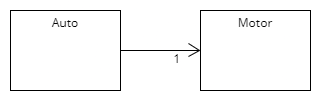
        </td>  
<td>

```java
public class Auto {
  Motor sinNombre;
}
  ``` 
</td>
</tr>
<tr>
<td> 

  ```
  lt=<-
  m1=0..1
  ```
</td>
<td>
        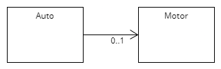
        </td>  
<td>

```java
public class Auto {
  Motor sinNombre;
}
  ``` 
</td>
</tr>
</table>

##### De cero/uno a muchos elementos
<table>
<tr>
<th> En UMLet (<em>Properties</em>) </th> <th> En UMLet (<em>renderizado</em>) </th> <th> En Java </th>
</tr>
<tr>
<td> 

  ```
  lt=<-
  m1=*
  ```
</td>
<td>
        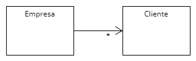
        </td>  
<td>

```java
public class Empresa {
  ArrayList<Cliente> sinNombre;
}
  ``` 
</td>
</tr>
<tr>
<td> 

  ```
  lt=<-
  m1=n
  ```
</td>
<td>
        
        </td>  
<td>

```java
public class Empresa {
  ArrayList<Cliente> sinNombre;
}
  ``` 
</td>
</tr>
<tr>
<td> 

  ```
  lt=<-
  m1=0..*
  ```
</td>
<td>
        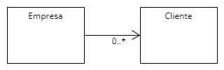
        </td>  
<td>

```java
public class Empresa {
  ArrayList<Cliente> sinNombre;
}
  ``` 
</td>
</tr>
<tr>
<td> 

  ```
  lt=<-
  m1=1..*
  ```
</td>
<td>
        
        </td>  
<td>

```java
public class Empresa {
  ArrayList<Cliente> sinNombre;
}
  ``` 
</td>
</tr>
<tr>
<td> 

  ```
  lt=<-
  m1=0..n
  ```
</td>
<td>
        
        </td>  
<td>

```java
public class Empresa {
  ArrayList<Cliente> sinNombre;
}
  ``` 
</td>
</tr>
<tr>
<td> 

  ```
  lt=<-
  m1=1..n
  ```
</td>
<td>
        
        </td>  
<td>

```java
public class Empresa {
  ArrayList<Cliente> sinNombre;
}
  ``` 
</td>
</tr>
</table>

##### Número definido de elementos
Si se define un número concreto (distinto de cero o uno), se utilizará un *array* para guardar los elementos

<table>
<tr>
<th> En UMLet (<em>Properties</em>) </th> <th> En UMLet (<em>renderizado</em>) </th> <th> En Java </th>
</tr>
<tr>
<td> 

  ```
  lt=<-
  m1=4
  ```
</td>
<td>
        
        </td>  
<td>

```java
public class Auto {
  Rueda[] sinNombre;
}
  ``` 
</td>
</tr>
<tr>
<td> 

  ```
  lt=<-
  m1=0..10
  ```
</td>
<td>
        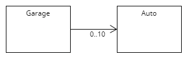
        </td>  
<td>

```java
public class Garage {
  Auto[] sinNombre;
}
  ``` 
</td>
</tr>
</table>

##### Arrays de más de una dimensión
Si en la cardinalidad aparecen varios números encerrados, cada uno, en un par de corchetes, se generará un array de tales dimensiones.

<table>
<tr>
<th> En UMLet (<em>Properties</em>) </th> <th> En UMLet (<em>renderizado</em>) </th> <th> En Java </th>
</tr>
<tr>
<td> 

  ```
  lt=<-
  m1=[4]
  ```
</td>
<td>
        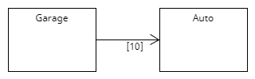
        </td>  
<td>

```java
public class Auto {
  Rueda[] sinNombre;
}
  ``` 
</td>
</tr>
<tr>
<td> 

  ```
  lt=<-
  m1=[8][8]
  ```
</td>
<td>
        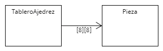
        </td>  
<td>

```java
public class TableroAjedrez {
  Pieza[][] sinNombre;
}
  ``` 
</td>
</tr>
</table>

#### Nombre de la relación
Debajo de la cardinalidad, se debe colocar la visibilidad (opcional) y el nombre del atributo generado.
Si no se coloca un nombre, se asumirá que es `sinNombre`.
La cardinalidad es obligatoria en caso de colocar nombre a la relación.
<table>
<tr>
<th> En UMLet (<em>Properties</em>) </th> <th> En UMLet (<em>renderizado</em>) </th> <th> En Java </th>
</tr>
<tr>
<td> 

  ```
  lt=<-
  ```
</td>
<td>
        
        </td>  
<td>

```java
public class Auto {
  Motor sinNombre;
}
  ``` 
</td>
</tr>
<tr>
<td> 

  ```
  lt=<-
  m1=1
  motor
  ```
</td>
<td>
        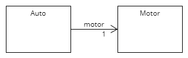
        </td>  
<td>

```java
public class Auto {
  Motor motor;
}
  ``` 
</td>
</tr>
<tr>
<td> 

  ```
  lt=<-
  m1=1
  -motor
  ```
</td>
<td>
        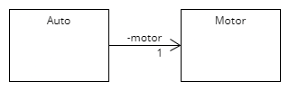
        </td>  
<td>

```java
public class Auto {
  private Motor motor;
}
```
</td>
</tr>
</table>

### Relación de generalización (herencia)
Una relación de generalización representa que una `ClaseA` es una `ClaseB`, por lo tanto, la `ClaseA` heredará de la `ClaseB`.
En UML, una generalización se representa con una flecha sólida de punta hueca (triangular).
Las relaciones de generalización, no llevan cardinalidad, ni nombre.
<table>
<tr>
<th> En UMLet (<em>Properties</em>) </th> <th> En UMLet (<em>renderizado</em>) </th> <th> En Java </th>
</tr>
<tr>
<td> 

  ```
  lt=<<-
  ```
</td>
<td>
        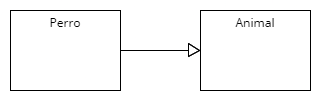
        </td>  
<td>

```java
public class Perro extends Animal {
  
}
  ``` 
</td>
</tr>
</table>

### Relación de realización (interfaz)
Una relación de realización representa que una `ClaseA` implementa a la  `InterfazB`.
En UML, una realización se representa con una flecha punteada de punta hueca (triangular).
Las relaciones de realización, no llevan cardinalidad, ni nombre.
<table>
<tr>
<th> En UMLet (<em>Properties</em>) </th> <th> En UMLet (<em>renderizado</em>) </th> <th> En Java </th>
</tr>
<tr>
<td> 

  ```
  lt=<<.
  ```
</td>
<td>
        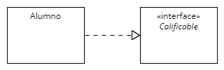
        </td>  
<td>

```java
public class Alumno implements Calificable {
  
}
  ``` 
</td>
</tr>
</table>
## Elementos omitidos
* Las relaciones de dependencia (representadas con flechas punteadas) son detectadas pero no producirán cambios en el código Java a generar.
* Cualquier elemento que no sea una clase o una flecha de relación será omitido por el generador de código.

## Errores posibles

